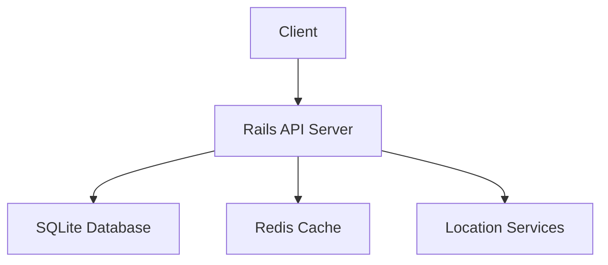
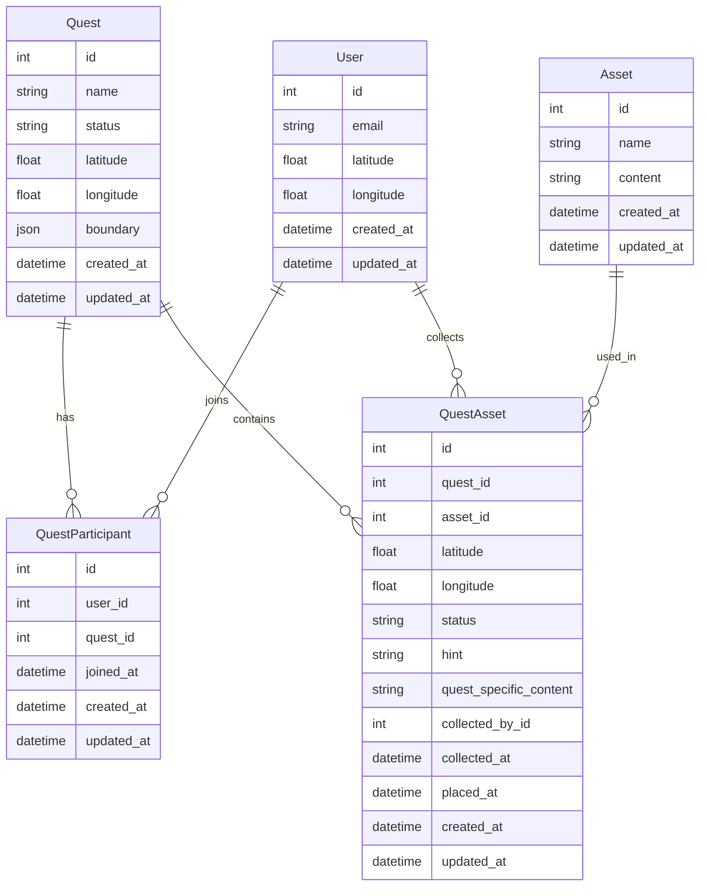

# Spatial Quest

A modern web application built with Ruby on Rails, leveraging its powerful features for rapid development and robust database management.

## Architecture Overview

Spatial Quest is a location-based quest game where users can join quests, collect assets, and place them in new locations. The application follows a RESTful architecture with the following key components:

### System Components



### Database Schema



### Database Tables Explanation

#### Users Table
The `users` table represents each individual user in our platform. Each user has:
- Basic information (email)
- Current location (latitude, longitude)
- Timestamps for record keeping

#### Quests Table
The `quests` table defines the quests available in the game. Each quest has:
- A name and status
- A central location (latitude, longitude)
- A geographical boundary (stored as JSON)
- Timestamps for record keeping

#### Assets Table
The `assets` table contains the base information for all assets in the game. Each asset has:
- A name and content
- Timestamps for record keeping

#### QuestAssets Table (Join Table)
The `quest_assets` table is a crucial join table that:
- Links assets to quests
- Allows the same asset to be used in multiple quests
- Stores quest-specific information for each asset:
  - Location (latitude, longitude)
  - Status (available, collected, placed)
  - Quest-specific content and hints
  - Collection and placement timestamps
  - Reference to the user who collected it

#### QuestParticipants Table (Join Table)
The `quest_participants` table manages the many-to-many relationship between users and quests:
- Links users to quests they've joined
- Tracks when users joined quests
- Allows users to participate in multiple quests
- Allows quests to have multiple participants

### Key Relationships

1. **Users and Quests**
   - Many-to-many relationship through `quest_participants`
   - A user can join multiple quests
   - A quest can have multiple participants
   - The `quest_participants` table tracks when users join quests

2. **Quests and Assets**
   - Many-to-many relationship through `quest_assets`
   - A quest can have multiple assets
   - An asset can be used in multiple quests
   - The `quest_assets` table stores:
     - Quest-specific location for each asset
     - Quest-specific content and hints
     - Asset status within each quest
     - Collection and placement information

3. **Users and QuestAssets**
   - One-to-many relationship
   - A user can collect multiple assets
   - Each asset can be collected by one user
   - The `quest_assets` table tracks:
     - Which user collected each asset
     - When the asset was collected
     - Where the asset was placed

This database design allows for:
- Reusing assets across different quests
- Tracking asset locations specific to each quest
- Managing user participation in multiple quests
- Maintaining quest-specific content and hints for assets
- Tracking the collection and placement of assets by users

### Key Features

1. **Location-Based Gameplay**
   - Users can join quests in their vicinity
   - Assets can only be collected when users are within 100 meters
   - Assets must be placed within quest boundaries

2. **Quest Management**
   - Quests have defined geographical boundaries
   - Users can join and leave quests
   - Quest completion is tracked automatically

3. **Asset Collection**
   - Assets are associated with specific quests
   - Assets can be collected and placed in new locations
   - Asset status is tracked (available, collected, placed)

4. **Caching System**
   - Location data is cached for performance
   - Users location is being cached for better perfomance.

## Technology Stack

### Ruby on Rails
I chose Ruby on Rails as our primary framework for several key reasons:

- **Active Record ORM**: Rails' built-in Object-Relational Mapping (ORM) system provides a powerful and intuitive way to interact with databases, eliminating the need for external ORM libraries
- **Rapid Development**: Rails' convention-over-configuration philosophy and built-in generators enable quick schema generation and scaffolding
- **Database Agnostic**: Easy integration with various databases while maintaining consistent code patterns

## Project Setup

### Prerequisites
- Docker
- Docker Compose

### Getting Started

1. Clone the repository.

2. run docker-compose build
3. run docker-compose up --build


The application will be available at `http://localhost:3000`

### Services
- **Web Application**: Ruby on Rails application running on port 3000
- **Database**: sqlite3
- **Cache**: Redis 7

## Development

### Database Migrations
Database migrations are automatically run when the container starts. To run migrations manually:

```bash
docker-compose exec web bundle exec rails db:migrate
```

### Running Tests
```bash
docker-compose exec -e RAILS_ENV=test web bundle exec rspec
```

### Test Coverage

The application includes comprehensive test coverage to ensure all key features work as expected:

1. **Quest Journey Spec (`spec/requests/quest_journey_spec.rb`)**
   - Tests the complete happy path of the quest journey
   - Verifies all key features including:
     - User joining a quest
     - Asset collection within proximity
     - Asset placement within quest boundaries
     - Quest completion tracking
     - Location-based interactions

2. **Quest Controller Spec (`spec/controllers/api/v1/quests_controller_spec.rb`)**
   - Tests individual quest controller actions
   - Verifies:
     - Quest creation and management
     - Quest listing and filtering
     - Quest participant management
     - Quest asset management
     - Error handling and edge cases

3. **Users Controller Spec (`spec/controllers/api/v1/users_controller_spec.rb`)**
   - Tests user-related functionality
   - Verifies:
     - User listing and retrieval
     - Location updates
     - Joined quests listing
     - Error handling for invalid locations
     - User proximity calculations

4. **Assets Controller Spec (`spec/controllers/api/v1/assets_controller_spec.rb`)**
   - Tests asset management functionality
   - Verifies:
     - Asset collection within proximity
     - Asset placement within boundaries
     - Asset status tracking
     - User's collected assets listing
     - Error handling for invalid operations

These test suites ensure the reliability and functionality of the core game mechanics and API endpoints.

### APIs

#### User APIs

The following endpoints are available for user management:

1. `GET /api/v1/users`
   - Lists all users in the system
   - This is a test endpoint to help with development and testing
   ```bash
   curl --location 'http://localhost:3000/api/v1/users'
   ```
   - Returns a JSON array of users with their details including:
     - id
     - email
     - latitude
     - longitude
     - created_at
     - updated_at

2. `GET /api/v1/users/:id/joined_quests`
   - Lists all quests that a user has joined
   ```bash
   curl --location 'http://localhost:3000/api/v1/users/1/joined_quests'
   ```
   - Returns a JSON object containing:
     - quests: Array of quest objects with their details
     - total_quests: Total number of quests joined

3. `PATCH /api/v1/users/:id/update_location`
   - Updates a user's current location
   - Required parameters:
     - latitude: User's current latitude
     - longitude: User's current longitude
   ```bash
   curl --location --request PATCH 'http://localhost:3000/api/v1/users/1/update_location' \
   --header 'Content-Type: application/json' \
   --data '{
       "latitude": 37.7749,
       "longitude": -122.4194
   }'
   ```
   - Returns a JSON object with the updated user details

Note: The index API (`GET /api/v1/users`) is primarily for testing purposes to help developers verify user data in the database and use existing users for testing other features.

#### Quest APIs

The following endpoints are available for quest management:

1. `GET /api/v1/quests`
   - Lists all available quests
   - Optional parameters (for filtering by location):
     - lat: User's current latitude
     - lon: User's current longitude
   - Note: If location parameters are not provided, returns all quests (useful for testing)
   ```bash
   # Get all quests (for testing)
   curl --location 'http://localhost:3000/api/v1/quests'

   # Get quests filtered by location
   curl --location 'http://localhost:3000/api/v1/quests?latitude=37.7749&longitude=-122.4194'
   ```
   - Returns a JSON array of quests with their details including:
     - id
     - name
     - status
     - latitude
     - longitude
     - boundary
     - created_at
     - updated_at

2. `GET /api/v1/quests/:id`
   - Gets details of a specific quest
   ```bash
   curl --location 'http://localhost:3000/api/v1/quests/1'
   ```
   - Returns a JSON object with the quest details

3. `GET /api/v1/quests/:id/quest_assets`
   - Lists all assets associated with a quest
   ```bash
   curl --location 'http://localhost:3000/api/v1/quests/1/quest_assets'
   ```
   - Returns a JSON object containing:
     - total_assets: Total number of assets in the quest
     - available_assets: Number of assets that haven't been collected
     - collected_assets: Number of assets that have been collected
     - placed_assets: Number of assets that have been placed
     - assets: Array of asset objects with their details

4. `POST /api/v1/quests/:id/join`
   - Allows a user to join a quest
   - Required parameters:
     - user_id: ID of the user joining the quest
   ```bash
   curl --location 'http://localhost:3000/api/v1/quests/1/join' \
   --header 'Content-Type: application/json' \
   --data '{
       "user_id": 1
   }'
   ```
   - Returns a JSON object with a success message

5. `DELETE /api/v1/quests/:id/leave`
   - Allows a user to leave a quest
   - Required parameters:
     - user_id: ID of the user leaving the quest
   ```bash
   curl --location --request DELETE 'http://localhost:3000/api/v1/quests/1/leave' \
   --header 'Content-Type: application/json' \
   --data '{
       "user_id": 1
   }'
   ```
   - Returns a JSON object with a success message

6. `GET /api/v1/quests/nearby`
   - Lists quests near a user's location
   - Required parameters:
     - user_id: ID of the user

   ```bash
   curl --location 'http://localhost:3000/api/v1/quests/nearby?user_id=1'
   ```
   - Returns a JSON array of nearby quests with their details

#### Asset APIs

The following endpoints are available for asset management:

1. `GET /api/v1/assets`
   - Lists all assets collected by a user
   - Required parameters:
     - user_id: ID of the user
   ```bash
   curl --location 'http://localhost:3000/api/v1/assets?user_id=1'
   ```
   - Returns a JSON object containing:
     - status: 'success'
     - assets: Array of asset objects with their details including:
       - id
       - name
       - content
       - quest_name
       - status
       - collected_at
       - placed_at

2. `POST /api/v1/assets/:id/collect`
   - Collects an asset in a quest
   - Required parameters:
     - user_id: ID of the user collecting the asset
     - quest_id: ID of the quest containing the asset
   ```bash
   curl --location 'http://localhost:3000/api/v1/assets/1/collect' \
   --header 'Content-Type: application/json' \
   --data '{
       "user_id": 1,
       "quest_id": 1
   }'
   ```
   - Returns a JSON object containing:
     - status: 'success'
     - message: 'Asset collected successfully'
     - asset: Object with asset details
     - quest_completed: Boolean indicating if the quest is completed

3. `POST /api/v1/assets/:id/place`
   - Places a collected asset at a new location
   - Required parameters:
     - user_id: ID of the user placing the asset
     - quest_id: ID of the quest
     - latitude: New latitude for the asset
     - longitude: New longitude for the asset
   ```bash
   curl --location 'http://localhost:3000/api/v1/assets/1/place' \
   --header 'Content-Type: application/json' \
   --data '{
       "user_id": 1,
       "quest_id": 1,
       "latitude": 37.7749,
       "longitude": -122.4194
   }'
   ```
   - Returns a JSON object containing:
     - status: 'success'
     - message: 'Asset placed successfully'
     - asset: Object with updated asset details including new location

Note: When collecting an asset, the user must be within 100 meters of the asset's location. When placing an asset, the new location must be within the quest's boundary.
